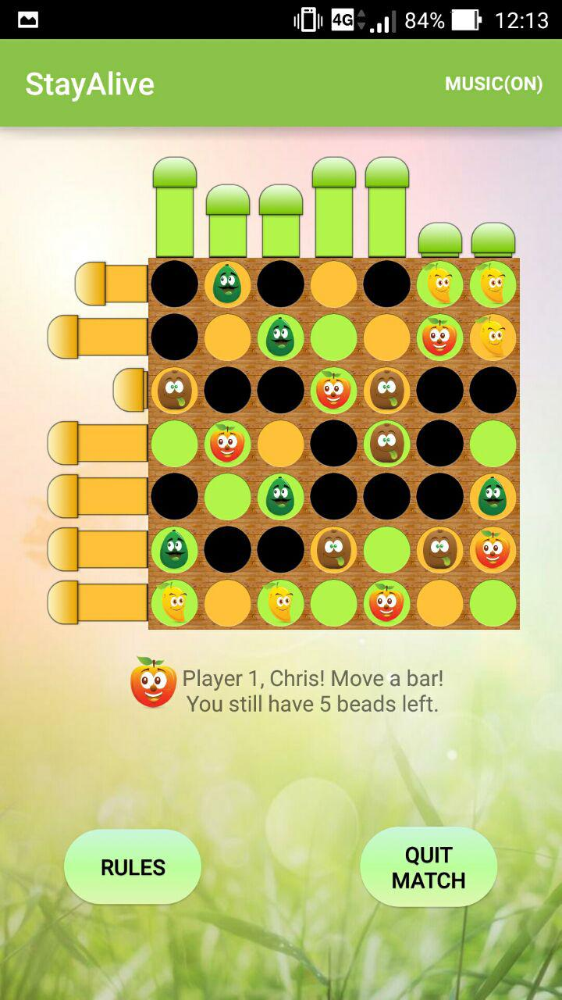
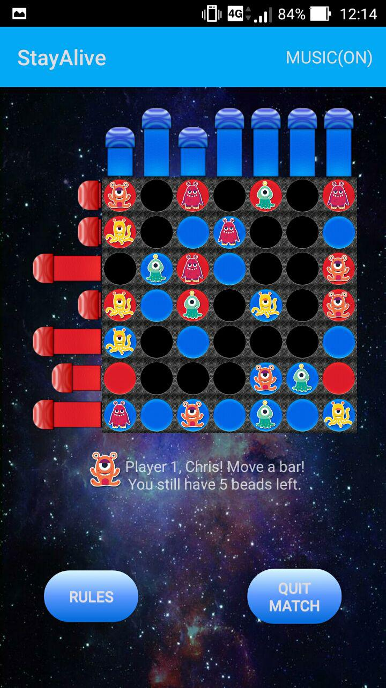

__StayAlive__

   

__OS:__ Android

__Description:__
Multiplayer board game developed in Java. 

<b>Game Mechanics</b>

The game involves two to four players. Each player places 5 beads on the board. This board is a square grid of 7x7 with 14 sliding bars, 7 placed vertically and 7 horizontally. Each bar has 3 positions (inner, middle, outer) and has 9 slots that can be holed or filled.

<b>The Goal:</b>

You have to move bars in order to drop down and kill all the beads of your opponents! Try to make your beads survive at this slaughter! Sliding a bar may cause uncovered holes to appear under a bead: that bead will fall and die.

<b>#RULE#1:</b>

You can't slide bars that were slid by your opponents in the previous turn.

<b>#RULE#2:</b>

When only 2 players are left, a player cannot slide the same bar for more than two consecutive turns (2 times: OK, 3 times: NO!).

<b>#RULE#3:</b>

If the last remaining beads belonging to some different players fall all down at the same time during a turn (and could be the last turn) the player who slided the bar (dead or not) beats the other ones. For the remaining players, and situations where there's no way to predict who died first, a mysterious Oracle will reveal the death sequence...

<b>#WARN#:</b>

If penalty mode is activated, touching a forbidden bar will give you 1 penalty! (Each penalty: -5 points subtracted to the final score). So, train your memory!

<b>#NOTES#:</b>

In penalty mode: if you try to move an outerPosition-forbiddenBar in outward direction, no penalty is added (because you're just trying to move it the wrong way)

https://www.boardgamegeek.com/boardgame/2770/stay-alive

<b>Enjoy!</b>
